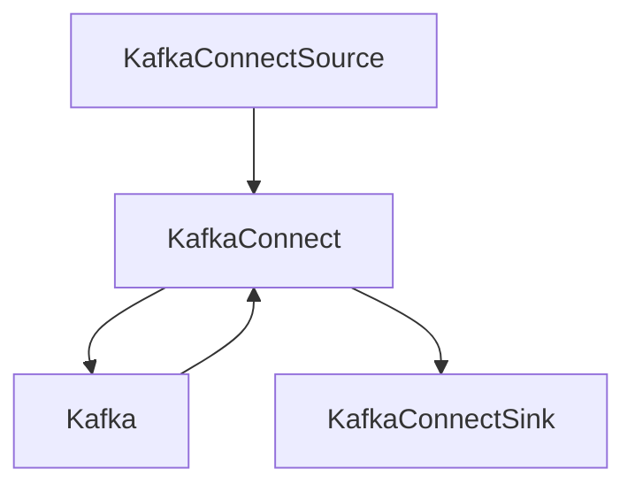

# kafka-connect-example
Steps to run Kafka Connect locally with some Connector examples and a Postman collection to manage your Connectors.


  

# Pre-Requesites

Install java.
```bash
curl -s "https://get.sdkman.io" | bash
source "$HOME/.sdkman/bin/sdkman-init.sh"
sdk install java 17.0.3.6.1-amzn
```

Run Kafka Connect
```bash
# Download Kafka Binary,Check here if the download location is not working https://kafka.apache.org/downloads
wget https://dlcdn.apache.org/kafka/3.2.0/kafka_2.13-3.2.0.tgz
mv kafka_2.13-3.2.0.tar $HOME/kafka.tar && cd $HOME
tar -xzvf kafka.tar
mv kafka_* kafka
# Configure the location for Connect plugins.
echo plugin.path=$HOME/kafka/libs >> $HOME/kafka/config/connect-distributed.properties
# Run Zookeeper
sh $HOME/kafka/bin/zookeeper-server-start.sh $HOME/kafka/config/zookeeper.properties
# Run Kafka
sh $HOME/kafka/bin/kafka-server-start.sh $HOME/kafka/config/server.properties
# Run Kafka Connect
sh $HOME/kafka/bin/connect-distributed.sh $HOME/kafka/config/connect-distributed.properties
# Test that it is working
curl --location --request GET 'http://localhost:8083/'

{"version":"3.2.0","commit":"38103ffaa962ef50","kafka_cluster_id":"c6URg2i-SHOLet0Dzp7hFA"}%       
```
🎉🎉🎉🎉🎉🎉🎉

# Postman

Get Postman http://www.postman.com

Import the collection https://github.com/cbrown184/kafka-connect-example/blob/main/kafka-connect-postman-collection.json

# Examples

- [File Connector Example](file-connector-example.md)
