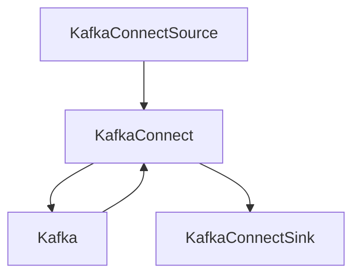

# kafka-connect-example
Steps to run Kafka Connect locally with some Connector examples and a Postman collection to manage your Connectors.


  

# Pre-Requesites

Install java.
```bash
curl -s "https://get.sdkman.io" | bash
source "$HOME/.sdkman/bin/sdkman-init.sh"
sdk install java 17.0.3.6.1-amzn
```

Download & extract Kafka binary. Check here if the download location is not working https://kafka.apache.org/downloads
```bash
wget https://dlcdn.apache.org/kafka/3.2.0/kafka_2.13-3.2.0.tgz
mv kafka_2.13-3.2.0.tar $HOME/kafka.tar && cd $HOME
tar -xzvf kafka.tar
```

