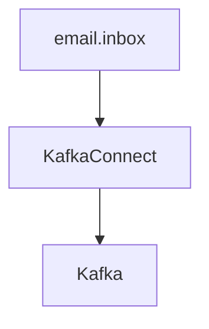

# Email Connector 




## Install jcustenborder/kafka-connect-email plugin

Download the zip file from here https://www.confluent.io/hub/jcustenborder/kafka-connect-email

Extract the folder to the Kafka Connect plugin path 

```bash
tar -xzvf jcustenborder-kafka-connect-email-0.1.0.2.zip -C $HOME/kafka/libs
```
Restart Kafka connect and verify the plugin is installed correctly.
```bash
curl --location --request GET 'http://localhost:8083/connector-plugins'
#    {
#        "class": "com.github.jcustenborder.kafka.connect.email.IMAPSourceConnector",
#        "type": "source",
#        "version": "0.0.0.0"
#    }
```
## Deploy Email Source Connector

If using Gmail, you will need to generate an API password. 
https://support.google.com/mail/answer/185833?hl=en-GB

Please refer to your email provider for connection information.

```bash
curl --location --request POST 'http://localhost:8083/connectors' \
--header 'Content-Type: application/json' \
--data-raw '{
  "name": "email-inbox-source",
  "config": {
    "connector.class": "com.github.jcustenborder.kafka.connect.email.IMAPSourceConnector",
    "tasks.max": 1,
    "imap.hostname": "imap.gmail.com",
    "imap.username":"email@gmail.com",
    "imap.password": "APP_PASSWORD",
    "imap.topic": "email-inbox",
    "imap.folder": "INBOX"
  }
}
'
```

Test it 
```bash
sh $HOME/kafka/bin/kafka-console-consumer.sh --bootstrap-server localhost:9092 --topic email-inbox
```
