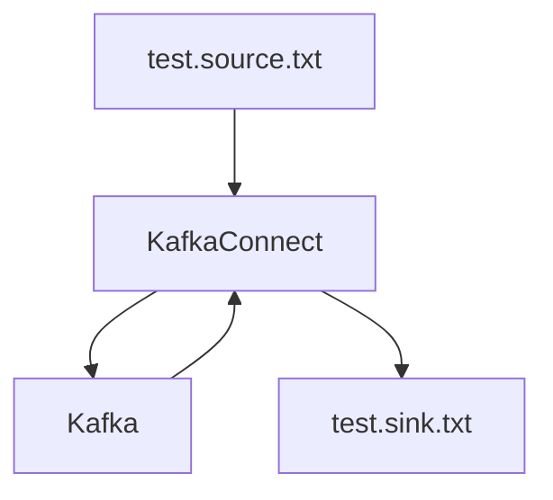

# File Stream Connector 

https://docs.confluent.io/platform/current/connect/filestream_connector.html



## Generate some data

Generate some data periodically into $HOME/test.source.txt

e.g
```bash
while sleep 5; do curl https://api.chucknorris.io/jokes/random >> $HOME/test.source.txt; echo "\n" >> $HOME/test.source.txt; done;
```

## Deploy File Source Connector

Deploy a File Source Connector which will send data from your file to a Kafka Topic "connect-file-test". You may want to use the absolute file path if the file cannot be found.
```bash
curl --location --request POST 'http://localhost:8083/connectors' \
--header 'Content-Type: application/json' \
--data-raw '{
  "name": "local-file-source",
  "config": {
    "connector.class": "FileStreamSource",
    "tasks.max": 1,
    "file": "test.source.txt",
    "topic": "connect-file-test"
  }
}
'
```

Test it 
```bash
sh $HOME/kafka/bin/kafka-console-consumer.sh --bootstrap-server localhost:9092 --topic connect-file-test
```

## Deploy File Sink Connector

Deploy a File Sink Connector which will send data from your Kafka Topic "connect-file-test" to a new file. You may want to use the absolute file path if the file cannot be found.
```bash
curl --location --request POST 'http://localhost:8083/connectors' \
--header 'Content-Type: application/json' \
--data-raw '{
  "name": "local-file-sink",
  "config": {
    "connector.class": "FileStreamSink",
    "tasks.max": 1,
    "file": "test.sink.txt",
    "topics": "connect-file-test"
  }
}
'
```

Check the test sink file, et voila - you should find your original data is being streamed from Kafka to a new output file. Figo!
```bash
tail -f $HOME/test.sink.txt
```


